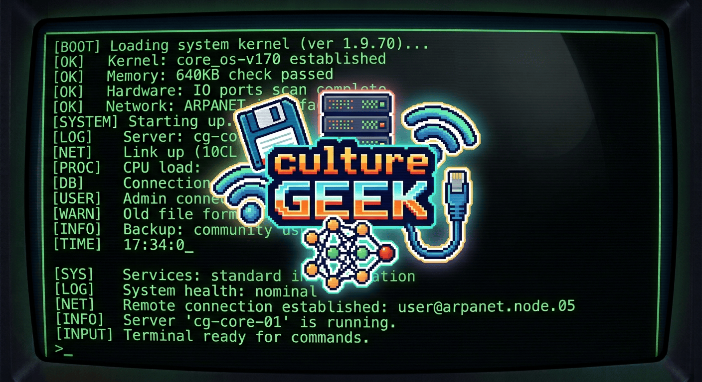

<center>

  

</center>

# Culture Geek

### Objectifs du cours

À la fin de ce cours, vous serez capable de :

- citer des femmes qui ont façonné l'informatique, et expliquer pourquoi elles restent méconnues ;
- définir ce qu'est un ordinateur et reconnaître les ordinateurs qui vous entourent ;
- trouver et lire une documentation, décoder un message d'erreur et poser une bonne question ;
- utiliser l'IA comme un assistant sans nuire à votre apprentissage ni à la confidentialité ;
- situer le hacking entre compétence, éthique et loi ;
- appliquer les règles de base de l'hygiène numérique, pour vous et dans votre code ;
- adopter les bonnes pratiques qui rendent un développeur fiable.

### Comment lire ce cours

Le cours s'ouvre sur un préambule, puis se découpe en six parties, indépendantes mais pensées pour être lues dans l'ordre :

0. [La tech n'existerait pas sans les femmes](#0-la-tech-nexisterait-pas-sans-les-femmes)
1. [C'est quoi un ordinateur ?](#1-cest-quoi-un-ordinateur-)
2. [RTFM : la doc, c'est la base](#2-rtfm--la-doc-cest-la-base)
3. [L'IA n'est pas votre amie (mais peut le devenir)](#3-lia-nest-pas-votre-amie-mais-peut-le-devenir)
4. [Le hacking : une histoire de chapeaux](#4-le-hacking--une-histoire-de-chapeaux)
5. [Sécurité et hygiène numérique](#5-sécurité-et-hygiène-numérique)
6. [Bonnes pratiques](#6-bonnes-pratiques)

Les questions posées en séance sont reprises dans des encadrés **« 🤔 À vous »** : essayez d'y répondre avant d'ouvrir la réponse. Une [auto-évaluation](#auto-évaluation) en fin de document permet de vérifier ce que vous avez retenu.

---

## 0. La tech n'existerait pas sans les femmes

> **🤔 À vous :** citez de tête cinq personnes qui ont marqué l'histoire de l'informatique. Combien de femmes dans votre liste ?

Si votre liste ressemble à « Turing, Jobs, Gates, Torvalds, Zuckerberg », c'est le cas de la plupart des gens. Pourtant, des femmes ont contribué à l'informatique à chacune de ses étapes, du premier programme à l'IA moderne.

### Les pionnières

| Année | Qui ? | Ce qu'on lui doit |
|---|---|---|
| 1843 | **Ada Lovelace** | le premier programme publié, pour la machine analytique de Charles Babbage |
| 1942 | **Hedy Lamarr** | un brevet de saut de fréquence, déposé avec le compositeur George Antheil : c'est le principe qu'utilise le Bluetooth |
| 1946 | **Les six programmeuses de l'ENIAC** | la programmation du premier ordinateur électronique généraliste |
| 1952 | **Grace Hopper** | le premier compilateur, puis le langage COBOL |

Attention aux raccourcis : Hedy Lamarr n'a pas inventé le saut de fréquence, qui existait avant son brevet, et contrairement à ce qu'on lit souvent, le Wi-Fi n'en découle pas.

Le *bug* de 1947 du [petit lexique geek](#petit-lexique-geek) ? Ce sont des techniciens du Harvard Mark II, l'ordinateur sur lequel travaillait Grace Hopper, qui ont trouvé le papillon de nuit coincé dans un relais… et l'ont scotché dans le journal de bord. Grace Hopper n'a ni trouvé l'insecte ni inventé le mot (les ingénieurs parlaient déjà de *bugs* au temps d'Edison), mais c'est elle qui a rendu l'histoire célèbre.

### Direction la Lune

| Année | Qui ? | Ce qu'on lui doit |
|---|---|---|
| 1962 | **Katherine Johnson** | vérifie à la main les trajectoires calculées par l'ordinateur pour le vol de John Glenn |
| années 1960 | **Dorothy Vaughan** | apprend le FORTRAN, puis le fait apprendre à son équipe quand les ordinateurs IBM arrivent à la NASA |
| 1969 | **Margaret Hamilton** | dirige l'équipe qui écrit le logiciel de vol d'Apollo 11, et popularise le terme *software engineering* |

Leur histoire, et celle de Mary Jackson, est racontée dans le film *Les Figures de l'ombre* (2016).

### Dans votre ordinateur et sur le réseau

| Année | Qui ? | Ce qu'on lui doit |
|---|---|---|
| 1972 | **Karen Spärck Jones** | l'IDF, à la base du classement des résultats des moteurs de recherche |
| 1980 | **Adele Goldberg** | Smalltalk, qui popularise la programmation orientée objet |
| 1984 | **Susan Kare** | les icônes du premier Macintosh : la corbeille, le Mac qui sourit… |
| 1984 | **Elizabeth Feinler** | les domaines de premier niveau : `.com`, `.org`, `.edu`… |
| 1985 | **Sophie Wilson** | le jeu d'instructions ARM, présent dans presque tous les smartphones |
| 1985 | **Radia Perlman** | le Spanning Tree Protocol, qui empêche les réseaux Ethernet de tourner en boucle |
| 1987 | **Barbara Liskov** | le principe de substitution, le **L** de SOLID |

### Côté jeu vidéo

| Année | Qui ? | Ce qu'on lui doit |
|---|---|---|
| 1980 | **Roberta Williams** | *Mystery House*, premier jeu d'aventure graphique, puis la série *King's Quest* |
| 1982 | **Carol Shaw** | *River Raid*, l'une des premières conceptrices de jeux vidéo |

### Aujourd'hui

| Année | Qui ? | Ce qu'on lui doit |
|---|---|---|
| 2009 | **Fei-Fei Li** | ImageNet, la base d'images qui a lancé l'essor de l'IA moderne |
| 2018 | **Joy Buolamwini** et **Timnit Gebru** | la preuve que la reconnaissance faciale se trompe bien plus sur les femmes noires |
| années 2010 | **Parisa Tabriz** | la sécurité de Google Chrome, avec « Security Princess » sur sa carte de visite |

### Et en France ?

| Année | Qui ? | Ce qu'on lui doit |
|---|---|---|
| 1961 | **Marion Créhange** | l'une des toutes premières thèses d'informatique en France, souvent présentée comme la première |
| 1971 | **Alice Recoque** | la conception du mini-ordinateur Mitra 15 ; le supercalculateur exaflopique français porte son nom |
| 2009 | **Ludivine Crépin** | les systèmes multi-agents hippocratiques (HiMAS) : des agents logiciels qui protègent les données personnelles de leurs utilisateurs |

### Pourquoi les connaît-on si peu ?

> **🤔 À vous :** avant de lire la suite, cherchez des raisons pour lesquelles ces noms sont si peu cités.

- Les six programmeuses de l'ENIAC ne sont même pas présentées lors de la démonstration publique de 1946.
- Stephanie Shirley, qui fonde en 1962 une société de logiciels, signe ses courriers « Steve » pour être prise au sérieux.
- L'**effet Matilda**, décrit par l'historienne Margaret Rossiter en 1993 : le travail des femmes scientifiques est minimisé, ou attribué à des hommes.
- Dans les années 1980, l'ordinateur personnel est vendu comme un jouet **pour garçons**. Aux États-Unis, la part de femmes parmi les diplômés en informatique passe de 37 % en 1984 à environ 18 % à la fin des années 2000, et n'est remontée qu'à 23 % en 2022.

Aux débuts de l'informatique, programmer était vu comme un travail de bureau « féminin ». Le métier s'est masculinisé en devenant prestigieux.

---

## 1. C'est quoi un ordinateur ?

### Penser en concepts

Plutôt que de se demander « qu'est-ce qu'un ordinateur ? », ce qui pousse à décrire l'objet posé sur le bureau, il est plus utile de se demander : **quel est le concept d'ordinateur ?**

Un concept est une définition fonctionnelle et factuelle d'une chose. Il ne décrit pas son apparence, il énonce ses caractéristiques. Par exemple, le concept de chaise pourrait être : « un objet dédié au fait de s'asseoir, avec un dossier, avec ou sans accoudoirs, avec un confort simple ». Conceptualiser, c'est penser les caractéristiques d'une chose sans la décrire visuellement.

Prenons le smartphone. Son concept pourrait être : « un appareil mobile de taille réduite (qui tient dans la main) disposant d'un écran tactile, d'un ou plusieurs dispositifs de capture d'images, permettant d'installer et d'utiliser tout type d'application, connecté à Internet par un ou plusieurs réseaux sans fil, et qui permet de téléphoner et de communiquer en mode texte ou vidéo ». Une fois posé ainsi, on voit bien qu'un smartphone est bien plus qu'un « simple » téléphone.

### Le concept d'ordinateur

Voici une définition du concept d'ordinateur :

> Une ou plusieurs unités de calcul, associées à une ou plusieurs interfaces d'entrée-sortie, associées à une ou plusieurs unités de stockage, tout ou partie de ces éléments pouvant être virtuels.

> **🤔 À vous :** en suivant cette définition, quels objets de votre quotidien sont « aussi » des ordinateurs ? Faites votre liste avant de lire la suite.

Avec cette définition, on se rend compte que les ordinateurs sont partout :

- le smartphone, la tablette, la montre connectée ;
- la console de jeu, la box internet, la télé « smart » ;
- la voiture, qui embarque plusieurs dizaines de calculateurs ;
- la machine à laver, le frigo connecté, l'ampoule connectée ;
- la carte bancaire, dont la puce est un mini-ordinateur ;
- le serveur qui héberge votre site… et qui n'existe peut-être pas physiquement.

Ce dernier point vient de la fin de la définition : « tout ou partie de ces éléments pouvant être **virtuels** ». Un ordinateur peut en effet être :

- une **machine virtuelle (VM)** : un ordinateur simulé par un autre ordinateur ;
- un **conteneur** (Docker…) : un environnement isolé qui partage le noyau du système hôte ;
- une ressource **cloud** : des ordinateurs loués à la demande, quelque part dans un datacenter.

Comme le dit l'adage : *le cloud, c'est juste l'ordinateur de quelqu'un d'autre.*

### L'architecture de von Neumann (1945)

Presque tous nos ordinateurs suivent encore le modèle décrit par John von Neumann en 1945 :

| Élément | Rôle | Exemple |
|---|---|---|
| Unité de calcul | exécute les instructions | CPU, GPU |
| Mémoire vive | stocke ce qui est en cours d'utilisation | RAM |
| Stockage | conserve les données durablement | SSD, disque dur |
| Entrées / sorties | communique avec l'extérieur | clavier, écran, réseau |

Sa particularité : le programme et les données sont stockés **dans la même mémoire**.

### Les unités

Les capacités de stockage et de mémoire s'expriment en octets, avec deux systèmes qui coexistent (et que l'on confond souvent) : le système international, en puissances de 1 000, et le système binaire, en puissances de 1 024.

| Unité | Valeur (SI) | Valeur (binaire) |
|---|---|---|
| Ko / Kio | 1 000 octets | 1 024 octets |
| Mo / Mio | 1 000 Ko | 1 024 Kio |
| Go / Gio | 1 000 Mo | 1 024 Mio |
| To / Tio | 1 000 Go | 1 024 Gio |

C'est pour cela qu'un disque vendu « 1 To » apparaît avec moins d'espace dans votre système d'exploitation, qui compte souvent en Tio.

### Les couches

Un ordinateur fonctionne par couches superposées :

```
  Vous
   │
  Applications                  navigateur, IDE, jeux...
   │
  Système d'exploitation (OS)   Windows, macOS, Linux, Android, iOS
   │
  Firmware                      BIOS / UEFI
   │
  Matériel                      CPU, RAM, stockage, périphériques
```

Chaque couche **cache la complexité** de celle du dessous : c'est le principe d'**abstraction**. Vous n'avez pas besoin de savoir comment le processeur exécute une instruction pour utiliser votre navigateur.

---

## 2. RTFM : la doc, c'est la base

### D'où vient RTFM ?

**RTFM** signifie **R**ead **T**he **F**\*\*\*ing **M**anual. C'est la réponse, pas très polie, que l'on reçoit sur un forum quand la réponse à sa question se trouve dans la documentation. Le message derrière est simple : **cherchez d'abord par vous-même**.

### Pourquoi la documentation officielle ?

Un tutoriel ou une vidéo peuvent aider, mais la documentation officielle a des avantages décisifs :

- elle est écrite par **ceux qui font l'outil** ;
- elle correspond à **une version précise** ;
- elle est **exhaustive** : tous les paramètres, tous les cas ;
- elle est **mise à jour**, contrairement au tuto de 2017.

> Un tuto vous montre **un** chemin. La doc vous donne **la carte**.

### Les quatre types de documentation (Diátaxis)

Le modèle Diátaxis distingue quatre types de documentation, chacun répondant à un besoin différent :

| Type | Objectif | Question à laquelle il répond |
|---|---|---|
| Tutoriel | apprendre | « Par où je commence ? » |
| Guide pratique | accomplir une tâche | « Comment je fais X ? » |
| Référence | décrire | « Que fait exactement cette option ? » |
| Explication | comprendre | « Pourquoi ça marche comme ça ? » |

Savoir quel type de documentation on cherche, c'est déjà savoir **où** chercher.

### Où trouver la doc ?

La documentation est souvent déjà **dans votre terminal** :

```bash
man ls           # le manuel complet d'une commande
ls --help        # l'aide courte (la plupart des commandes)
help cd          # l'aide des commandes internes de bash (cd, echo, export...)
git help commit  # le manuel d'une commande git (= git commit --help)
git commit -h    # le résumé des options
```

En ligne, les références incontournables sont **git-scm.com/docs**, le livre **Pro Git** (gratuit et traduit en français) et le **manuel de Bash** sur gnu.org.

### Lire une page `man`

Toutes les pages de manuel suivent la même structure :

| Section | Contenu |
|---|---|
| NAME | le nom et une ligne de description |
| SYNOPSIS | comment appeler la commande |
| DESCRIPTION | ce qu'elle fait |
| OPTIONS | toutes les options, une par une |
| EXAMPLES | des exemples (quand il y en a !) |
| SEE ALSO | les commandes voisines |

La section SYNOPSIS utilise une notation qu'il faut savoir décoder. Prenons :

```
cp [OPTION]... SOURCE... DIRECTORY
```

- `[ ]` signifie **optionnel** ;
- `...` signifie **répétable** (plusieurs options, plusieurs sources) ;
- `MAJUSCULES` ou `<chevrons>` désignent une valeur **à remplacer** par la vôtre ;
- `a | b` signifie **l'un ou l'autre**.

Ainsi, `cp -r -v img/ css/ backup/` est une commande valide : deux options, deux sources, un dossier de destination.

Pour naviguer dans une page `man` :

| Touche | Action |
|---|---|
| `Espace` / `b` | page suivante / précédente |
| `/mot` | chercher « mot » |
| `n` / `N` | occurrence suivante / précédente |
| `q` | quitter |

Ne lisez pas une doc comme un roman : cherchez (`/`) l'information dont vous avez besoin.

À noter : sous Git Bash (Windows), la commande `man` n'existe pas. `git help` ouvre alors la documentation dans le navigateur, et `--help` fonctionne pour le reste.

### Le message d'erreur est aussi une doc

Prenons ce message :

```
$ git push
To github.com:moi/projet.git
 ! [rejected]        main -> main (fetch first)
error: failed to push some refs to 'github.com:moi/projet.git'
hint: Updates were rejected because the remote contains work that you do
hint: not have locally. This is usually caused by another repository pushing
hint: to the same ref. You may want to first integrate the remote changes
hint: (e.g., 'git pull ...') before pushing again.
hint: See the 'Note about fast-forwards' in 'git push --help' for details.
```

> **🤔 À vous :** que vous dit ce message ? Quel est le problème, et que faut-il faire ?

À y regarder de près, il dit tout :

- **quoi** : le push de `main` a été **refusé** (`rejected`) ;
- **pourquoi** : le dépôt distant contient des commits que vous n'avez pas en local ;
- **que faire** : récupérer ces changements d'abord (`git pull`), puis pousser ;
- **où en savoir plus** : `git push --help`, section *Note about fast-forwards*.

Git vous donne **la cause**, **la solution** et **le lien vers la doc**. Lisez donc l'erreur **en entier** avant de la copier dans un moteur de recherche. Et surtout, pas de `git push --force` pour « faire passer » : vous écraseriez le travail des autres.

### Qui se plaint ?

Autre réflexe utile : identifier **qui** parle dans un message d'erreur. Le premier mot le dit.

```
$ gti status
bash: gti: command not found
$ cd Mes Documents
bash: cd: too many arguments
$ ./deploy.sh
bash: ./deploy.sh: Permission denied
$ git comit -m "ajout du menu"
git: 'comit' is not a git command. See 'git --help'.
```

> **🤔 À vous :** pour chaque erreur, qui parle, et quel est le problème ?

<details>
<summary>Voir la réponse</summary>

- `gti` : c'est **bash** qui parle. Faute de frappe, il ne trouve aucune commande de ce nom.
- `cd Mes Documents` : **bash** encore. L'espace sépare les arguments, `cd` en reçoit donc deux. Solution : `cd "Mes Documents"`.
- `./deploy.sh` : **bash**. Le fichier n'est pas exécutable. Solution : `chmod +x deploy.sh`.
- `git comit` : cette fois bash a bien trouvé `git`, c'est **git** lui-même qui ne connaît pas la sous-commande `comit`.

</details>

### Chercher efficacement

Quand la doc locale ne suffit pas :

- cherchez **en anglais** : vous aurez dix fois plus de résultats ;
- utilisez des **mots-clés** plutôt que des phrases : `git undo last commit` ;
- mettez le `"message exact"` entre guillemets : `"refusing to merge unrelated histories"` ;
- ciblez un site : `site:git-scm.com`, `site:unix.stackexchange.com` ;
- connaissez votre **version** : `git --version`, `bash --version` ;
- regardez la **date** des résultats.

### Stack Overflow et les forums

Sur un forum, lisez d'abord la **question** : est-ce vraiment votre problème ? Vérifiez la **date** et la **version** utilisée, lisez **plusieurs réponses** ainsi que les commentaires, et **comprenez** avant de copier-coller.

Soyez particulièrement méfiant avant de coller une commande contenant `sudo`, `rm -rf`, `git push --force`, `git reset --hard` ou `curl ... | bash`.

> Si vous ne pouvez pas expliquer la commande que vous avez copiée, ne l'exécutez pas.

### Bien poser une question

Quand vous demandez de l'aide, donnez :

1. **le contexte** : OS, shell (bash, zsh, PowerShell…), `git --version`, ce que vous essayez de faire ;
2. **l'attendu** : ce qui devrait se passer ;
3. **l'obtenu** : la commande tapée **et** sa sortie complète (copiée en texte, pas une photo de l'écran) ;
4. **ce que vous avez essayé** ;
5. **un exemple minimal** : les quelques commandes qui reproduisent le problème (plus un `git status`).

Bien souvent, en rédigeant l'étape 5… on trouve la solution tout seul.

### La méthode du canard en plastique 🦆

Expliquez votre code, ligne par ligne, à voix haute… à un canard en plastique. En expliquant, vous vous obligez à formuler ce que vous croyez que le code fait, et vous découvrez souvent que ce n'est pas ce qu'il fait réellement. Un collègue marche aussi, mais il a moins de patience.

### Exercice : où chercheriez-vous ?

> **🤔 À vous :** sans moteur de recherche, uniquement avec le terminal, comment trouveriez-vous :
>
> 1. l'option de `ls` qui affiche les fichiers cachés ?
> 2. l'option de `git log` qui affiche chaque commit sur une ligne ?
> 3. la signification de `$?` en bash ?
> 4. la différence entre `git reset` et `git revert` ?

<details>
<summary>Voir la réponse</summary>

| Question | Où chercher | Réponse |
|---|---|---|
| Afficher les fichiers cachés | `ls --help`, puis `/hidden` | `ls -a` |
| Afficher le log sur une ligne | `git log -h` | `git log --oneline` |
| Que signifie `$?` | `man bash`, puis `/Special Parameters` | le code de retour de la dernière commande |
| `reset` ou `revert` ? | `git help reset`, `git help revert` | `reset` réécrit l'historique, `revert` ajoute un commit qui annule |

Tout était déjà dans le terminal.

</details>

---

## 3. L'IA n'est pas votre amie (mais peut le devenir)

### Qu'est-ce qu'un LLM ?

ChatGPT, Claude, Copilot, Gemini… reposent tous sur des **LLM** (*Large Language Models*).

> **🤔 À vous :** en reprenant la méthode de la partie 1, quel serait le concept d'un LLM ? Qu'est-ce qu'il fait, concrètement ?

Leur concept :

> Un modèle statistique, entraîné sur une énorme quantité de textes, qui produit la suite **la plus probable** d'un texte donné, morceau par morceau (token par token).

Un LLM n'est donc **pas** une base de données, **pas** un moteur de recherche, et **pas** une personne.

### Pourquoi « pas votre amie » ?

**Elle peut se tromper, avec beaucoup d'assurance.**

- **Hallucinations** : elle peut inventer des fonctions, des bibliothèques, des options ou des sources qui n'existent pas.
- **Connaissances datées** : elle ne connaît pas forcément la dernière version d'un outil.
- **Complaisance** : elle a tendance à vous donner raison.
- **Code plausible ≠ code correct** : ça a l'air bien, mais est-ce que ça marche ? Est-ce sécurisé ?

**Elle peut vous empêcher d'apprendre.** Apprendre demande un effort : chercher, se tromper, comprendre. Si l'IA fait cet effort à votre place, c'est elle qui fait l'exercice, pas vous. Et en entretien, en examen ou en production à 3 h du matin, elle ne sera pas toujours là. On n'apprend pas à nager en regardant quelqu'un nager.

**Ce que vous lui donnez ne vous appartient plus tout à fait.** Ne collez jamais de mots de passe, de clés d'API ou de fichiers `.env`, ni de données personnelles (clients, collègues…), ni de code confidentiel de votre entreprise sans autorisation. Renseignez-vous sur la politique de votre entreprise : quels outils et quelles données sont autorisés.

### Mais elle peut le devenir

Utilisée comme un **assistant** et non comme un **pilote**, l'IA est précieuse pour :

- expliquer un message d'erreur ou un concept ;
- reformuler une doc difficile, avec d'autres exemples ;
- vous poser des questions pour **vérifier** que vous avez compris ;
- relire votre code et suggérer des améliorations ;
- générer des cas de test auxquels vous n'aviez pas pensé ;
- jouer le canard en plastique… qui répond.

### Bien lui parler

Évitez les demandes du type : « Dis-moi comment [faire telle chose]. »

Préférez : « Je suis en formation [développeur web, DevOps…], dans le contexte suivant : [langage, outils, contraintes]. Je souhaite [objectif]. Voici comment je ferais : [ma solution]. Dis-moi ce que tu en penses. »

Donnez-lui un **contexte**, un **objectif**, et **votre proposition d'abord** : l'IA commente alors votre raisonnement au lieu de le remplacer.

### Toujours vérifier

- **Exécutez** le code, ne vous contentez pas de le lire.
- **Testez** les cas limites : vide, nul, très grand, caractères spéciaux…
- **Vérifiez dans la doc** que la fonction proposée existe (RTFM !).
- **Vérifiez** qu'un paquet suggéré existe vraiment et est maintenu avant de l'installer.

> Vous êtes responsable du code que vous livrez. Si vous ne pouvez pas l'expliquer, ne le commitez pas.

### La règle pendant la formation

> **D'abord comprendre, ensuite accélérer.**

C'est comme la calculatrice : on apprend d'abord à compter, puis on l'utilise pour aller plus vite. Concrètement, faites chaque exercice **sans IA** d'abord. Si vous êtes bloqué, sollicitez la doc, vos collègues, le formateur, et **ensuite** l'IA, pour vous **expliquer** et non pour **faire** à votre place.

---

## 4. Le hacking : une histoire de chapeaux

### Qu'est-ce qu'un hacker ?

À l'origine (au MIT, à la fin des années 1950), un **hack** est une solution astucieuse et inattendue à un problème. Un hacker est quelqu'un qui aime comprendre comment les choses fonctionnent… pour les détourner.

Hacker n'est donc pas synonyme de pirate : le hacking est une **compétence**, pas une intention.

### Pourquoi des chapeaux ?

Dans les vieux westerns, les gentils portaient un chapeau **blanc** et les méchants un chapeau **noir**. Le vocabulaire de la sécurité a repris cette image :

| Chapeau | Qui ? | Autorisé ? |
|---|---|---|
| ⚪ White hat | cherche des failles pour les faire corriger (pentesteur, chercheur) | ✅ oui |
| ⚫ Black hat | exploite des failles pour nuire ou s'enrichir | ❌ non |
| 🔘 Grey hat | entre les deux : pénètre sans autorisation, mais sans (trop) nuire | ❌ non |

En entreprise, on parle aussi de **Red team** (l'équipe qui attaque), de **Blue team** (celle qui défend) et de **Purple team** (les deux qui travaillent ensemble).

### Quelques histoires célèbres

| Année | Événement |
|---|---|
| 1988 | Le **ver Morris** paralyse une partie de l'Internet de l'époque |
| 1995 | Arrestation de **Kevin Mitnick**, maître de l'ingénierie sociale |
| 2010 | **Stuxnet**, un virus conçu pour saboter des centrifugeuses nucléaires |
| 2017 | **WannaCry**, un rançongiciel qui touche notamment les hôpitaux britanniques |

### La faille la plus exploitée : l'humain

> **🤔 À vous :** avant de lire le titre de cette section… quelle est, selon vous, la faille la plus exploitée ?

La faille la plus exploitée n'est pas technique, c'est **l'humain**. L'**ingénierie sociale** consiste à obtenir un accès en manipulant les gens plutôt que les machines :

- un faux mail de la banque (phishing) ;
- un faux appel du « support informatique » ;
- une clé USB « oubliée » sur le parking ;
- un inconnu à qui vous tenez la porte du bureau.

### Et la loi ?

En France, le Code pénal (articles 323-1 et suivants, issus de la loi Godfrain de 1988) punit :

- l'**accès** frauduleux à un système informatique ;
- le **maintien** frauduleux dans ce système ;
- l'**entrave** à son fonctionnement ;
- la **modification** ou la suppression de données.

« Je voulais juste voir si c'était possible » n'est **pas** une défense. Sans autorisation écrite, c'est illégal.

### Hacker légalement

Il existe heureusement de nombreuses façons de pratiquer dans un cadre légal :

- les **CTF** (*Capture The Flag*), des compétitions de hacking ;
- les plateformes d'entraînement comme **Root-Me**, **TryHackMe** ou **Hack The Box** ;
- le **bug bounty** : être payé pour trouver des failles (YesWeHack, HackerOne…) ;
- la **divulgation responsable** : prévenir l'éditeur avant de rendre une faille publique.

### Et pour un développeur ?

Vous écrirez du code qui **sera attaqué**. Il faut donc connaître les attaques classiques :

- l'**injection** (SQL, commandes…) : ne faites jamais confiance aux entrées utilisateur ;
- le **XSS** : l'injection de JavaScript dans une page ;
- le **contrôle d'accès défaillant** : un utilisateur accède aux données d'un autre ;
- les **mots de passe mal stockés** : en clair, ou avec un hash faible.

La référence en la matière est l'**OWASP Top 10**, la liste des risques les plus critiques pour les applications web.

---

## 5. Sécurité et hygiène numérique

### Contre quoi se protège-t-on ?

La sécurité parfaite n'existe pas. L'objectif est de rendre l'attaque **plus coûteuse** que ce qu'elle rapporte.

La plupart des attaques ne vous visent pas **personnellement** : elles sont **automatisées** et visent les cibles les plus faciles. Le but est donc simple : ne pas être la cible la plus facile.

### Qu'est-ce qu'un bon mot de passe ?

> **🤔 À vous :** entre `P@ssw0rd!` et `cheval-agrafe-batterie-correct`, lequel est le plus solide, et pourquoi ?

Comparons :

- `P@ssw0rd!` est court, prévisible, et figure dans tous les dictionnaires d'attaque ;
- `cheval-agrafe-batterie-correct` est long, simple à retenir, et bien plus dur à deviner.

La **longueur** compte plus que la complexité. Et surtout : **un mot de passe différent pour chaque site**.

### Pourquoi un mot de passe unique par site ?

Le scénario est toujours le même :

1. un site mal sécurisé se fait voler sa base de données ;
2. votre e-mail et votre mot de passe se retrouvent en vente ;
3. des robots essaient cette combinaison **partout** : messagerie, banque, réseaux sociaux…

C'est ce qu'on appelle le **credential stuffing**. Vous pouvez vérifier si votre adresse a déjà fuité sur **haveibeenpwned.com**.

### Le gestionnaire de mots de passe

Impossible de retenir 150 mots de passe uniques ? C'est normal, et c'est le rôle d'un gestionnaire de mots de passe. Vous ne retenez qu'un seul mot de passe **maître**, long et solide ; le gestionnaire génère et retient tous les autres. Exemples : **Bitwarden**, **KeePassXC**, **Proton Pass**, 1Password…

« Et si le gestionnaire se fait pirater ? » C'est un risque, mais il est bien plus faible que celui de réutiliser le même mot de passe partout.

### L'authentification multifacteur (MFA / 2FA)

La MFA consiste à prouver son identité avec **au moins deux** facteurs de nature différente :

| Facteur | Exemple |
|---|---|
| Ce que je **sais** | mot de passe, code PIN |
| Ce que je **possède** | téléphone, clé de sécurité |
| Ce que je **suis** | empreinte digitale, visage |

Du plus fort au plus faible : **passkey / clé physique** > **application (TOTP)** > **SMS** > rien.

Activez-la au minimum sur votre **e-mail** : c'est lui qui permet de réinitialiser tous vos autres comptes.

### Le phishing (hameçonnage)

Les signaux d'alerte à connaître :

- l'**urgence** : « votre compte sera suspendu dans 24 h » ;
- un **expéditeur** bizarre : `service@lab4nque-postale.com` ;
- un **lien** qui ne mène pas où il prétend (survolez-le avant de cliquer) ;
- une demande d'**informations sensibles** : mot de passe, code reçu par SMS, numéro de carte ;
- une offre **trop belle** pour être vraie.

Votre banque ne vous demandera **jamais** votre mot de passe.

### Les bons réflexes

- **Faites les mises à jour** (OS, navigateur, applications) : la plupart corrigent des failles.
- **Sauvegardez** en suivant la règle du **3-2-1** : **3** copies de vos données, sur **2** supports différents, dont **1** hors site (cloud, autre lieu).
- **Verrouillez** votre session quand vous quittez votre poste (`Win + L`).
- Sur un **Wi-Fi public**, évitez les opérations sensibles et vérifiez que le site est en **HTTPS**.

### Vos traces numériques

Tout ce qui est publié sur Internet peut y **rester**. Les recruteurs **cherchent votre nom**. Les photos contiennent des **métadonnées** (lieu, date, appareil). Et chaque service « gratuit » se paie avec vos **données**.

Le **RGPD** vous donne des droits sur vos données : accès, rectification, effacement, portabilité…

### Côté développeur

- **Jamais** de secret dans le code ni dans Git : utilisez un fichier `.env` et le `.gitignore`.
- Un secret poussé sur Git est un secret **compromis** : il faut le **révoquer**, pas seulement le supprimer du dépôt.
- **Dépendances** : chaque paquet installé est du code écrit par un inconnu. Auditez-les (`npm audit`, `composer audit`).
- **Moindre privilège** : chaque utilisateur, service ou base de données n'a accès qu'au strict nécessaire.
- Les mots de passe des utilisateurs doivent être **hachés** avec un algorithme adapté (bcrypt, Argon2), jamais stockés en clair.

### Ressources

- **cybermalveillance.gouv.fr** : conseils et assistance aux victimes ;
- **ANSSI** : le *Guide d'hygiène informatique* ;
- **haveibeenpwned.com** : vérifier si vos comptes ont fuité ;
- **OWASP** : la sécurité des applications web.

### Faites le point

Posez-vous honnêtement ces questions :

- Utilisez-vous le même mot de passe sur plusieurs sites ?
- Avez-vous activé la MFA sur votre e-mail principal ?
- Utilisez-vous un gestionnaire de mots de passe ?
- Avez-vous déjà cliqué (ou failli cliquer) sur un lien de phishing ?
- Avez-vous une sauvegarde de vos données de moins d'un mois ?
- Avez-vous déjà perdu des données pour de bon ?

Pas de honte : tout le monde a au moins une réponse qui n'est pas la bonne.

---

## 6. Bonnes pratiques

### Le code est fait pour être lu

Le code est lu **beaucoup plus souvent** qu'il n'est écrit. Par vos collègues, par le formateur, le jury ou le recruteur, par le développeur qui vous remplacera… et par **vous-même**, dans six mois.

### Nommer les choses

```js
// ❌
const d = 86400;
function calc(a, b) { return a * b * 0.2; }

// ✅
const SECONDS_PER_DAY = 86400;
function computeVat(unitPrice, quantity) { return unitPrice * quantity * VAT_RATE; }
```

- Choisissez des noms qui disent **ce que c'est**, pas comment c'est fait.
- Choisissez une langue (souvent l'anglais) et **tenez-vous-y**.
- Respectez les **conventions** du langage (`camelCase`, `snake_case`…).

### Les principes à connaître

| Principe | Signification | En clair |
|---|---|---|
| **KISS** | Keep It Simple, Stupid | la solution simple est souvent la bonne |
| **DRY** | Don't Repeat Yourself | une logique = un seul endroit |
| **YAGNI** | You Aren't Gonna Need It | ne codez pas ce dont vous n'avez pas besoin **maintenant** |

### Versionner son travail

Utilisez **Git** dès la première ligne de code, même pour un petit projet. Faites des **petits commits**, souvent, avec des **messages** qui expliquent ce qui change et pourquoi.

```
❌ fix
❌ modifs
❌ ça marche enfin !!!
✅ Corrige le calcul de la TVA sur les produits remisés
```

### Tester

« Ça marche sur ma machine » n'est pas un test.

- Testez **manuellement** : le cas normal, les cas vides, les cas absurdes.
- Écrivez des **tests automatisés** : ils vérifient que ce qui marchait marche toujours.
- Un bug corrigé doit donner lieu à un test qui l'empêche de revenir.

### Maîtriser ses outils

Un bon artisan connaît ses outils :

- apprenez les **raccourcis clavier** de votre éditeur (et de votre OS) ;
- n'ayez pas peur du **terminal** ;
- utilisez le **débogueur** plutôt que des `console.log` partout ;
- personnalisez votre environnement… sans y passer vos journées.

### Apprendre à apprendre

Dans ce métier, une partie de ce que vous apprenez aujourd'hui sera obsolète dans cinq ans. Il faut donc entretenir ses connaissances :

- faites de la **veille** : newsletters, blogs, podcasts, conférences ;
- menez des **projets perso** : c'est là qu'on apprend le plus ;
- **lisez du code** : celui des autres, celui des projets open source ;
- rejoignez une **communauté** : meetups, Discord, forums ;
- osez dire **« je ne sais pas »**… puis cherchez.

### Prendre soin de soi

- **Faites des pauses** : la solution arrive souvent loin de l'écran.
- Réglez bien votre **posture** et votre **écran** : vous allez passer des milliers d'heures assis.
- **Dormez** : le code écrit à 3 h du matin, c'est le bug de demain.
- **Demandez de l'aide** après avoir cherché, mais sans attendre trois jours.

### Petit lexique geek

| Expression | Signification |
|---|---|
| *Hello World* | le premier programme de tout développeur |
| *It works on my machine* | l'excuse universelle |
| *Have you tried turning it off and on again?* | la solution universelle |
| *42* | la réponse à la grande question sur la vie, l'univers et le reste |
| *Bug* | un défaut, en souvenir d'un papillon de nuit coincé dans un ordinateur en 1947 |
| *PEBKAC* | *Problem Exists Between Keyboard And Chair* |

---

## Ce qu'il faut retenir

0. La tech s'est construite **avec** les femmes, même quand l'histoire les a oubliées.
1. Un ordinateur est un **concept**, et il y en a partout.
2. **RTFM** : la documentation est votre première source.
3. L'IA est un **assistant**, pas un pilote : vous restez responsable.
4. Hacker est une compétence : le **chapeau**, c'est l'intention (et l'autorisation).
5. Mots de passe **uniques**, **gestionnaire**, **MFA**, **mises à jour**.
6. Écrivez du code pour **ceux qui le liront**.

---

## Auto-évaluation

Répondez de tête, puis ouvrez la réponse. Si vous hésitez, relisez la partie indiquée.

1. Citez trois femmes qui ont marqué l'informatique, et ce qu'on leur doit. *(partie 0)*
2. Qu'est-ce que l'effet Matilda ? *(partie 0)*
3. Pourquoi une carte bancaire est-elle un ordinateur ? *(partie 1)*
4. Quelle est la différence entre 1 Go et 1 Gio ? *(partie 1)*
5. Dans le synopsis `cp [OPTION]... SOURCE... DIRECTORY`, que signifient `[ ]` et `...` ? *(partie 2)*
6. Dans `bash: cd: too many arguments`, qui parle, et comment corriger `cd Mes Documents` ? *(partie 2)*
7. Citez deux raisons pour lesquelles l'IA « n'est pas votre amie ». *(partie 3)*
8. Quelle est la différence entre un white hat et un grey hat ? *(partie 4)*
9. Qu'est-ce que le credential stuffing, et quelle habitude vous en protège ? *(partie 5)*
10. Vous avez poussé une clé d'API sur GitHub. Suffit-il de la supprimer du dépôt ? *(partie 5)*
11. Que signifie YAGNI ? *(partie 6)*

<details>
<summary>Voir les réponses</summary>

1. Au choix : Ada Lovelace (le premier programme publié), Grace Hopper (le premier compilateur), Margaret Hamilton (le logiciel de vol d'Apollo 11), Radia Perlman (le Spanning Tree Protocol), Barbara Liskov (le **L** de SOLID), Sophie Wilson (le jeu d'instructions ARM), Fei-Fei Li (ImageNet)…
2. La tendance à minimiser le travail des femmes scientifiques, ou à l'attribuer à des hommes.
3. Sa puce contient une unité de calcul, une mémoire de stockage et une interface d'entrée-sortie (le contact avec le terminal de paiement) : elle correspond au concept d'ordinateur.
4. 1 Go vaut 1 000 Mo (système international), 1 Gio vaut 1 024 Mio (système binaire).
5. `[ ]` indique un élément optionnel, `...` un élément répétable.
6. C'est bash qui parle : l'espace sépare les arguments. Il faut écrire `cd "Mes Documents"`.
7. Au choix : elle hallucine avec assurance, ses connaissances sont datées, elle a tendance à vous donner raison, elle peut vous empêcher d'apprendre, les données que vous lui confiez ne vous appartiennent plus tout à fait.
8. Le white hat agit avec autorisation pour faire corriger les failles ; le grey hat agit sans autorisation, même sans intention de nuire, ce qui reste illégal.
9. Des robots réessaient sur d'autres sites les identifiants volés sur un site. Un mot de passe unique par site (avec un gestionnaire) et la MFA vous en protègent.
10. Non : la clé reste dans l'historique Git et a pu être copiée. Il faut la **révoquer** et en générer une nouvelle.
11. *You Aren't Gonna Need It* : ne codez pas ce dont vous n'avez pas besoin maintenant.

</details>
